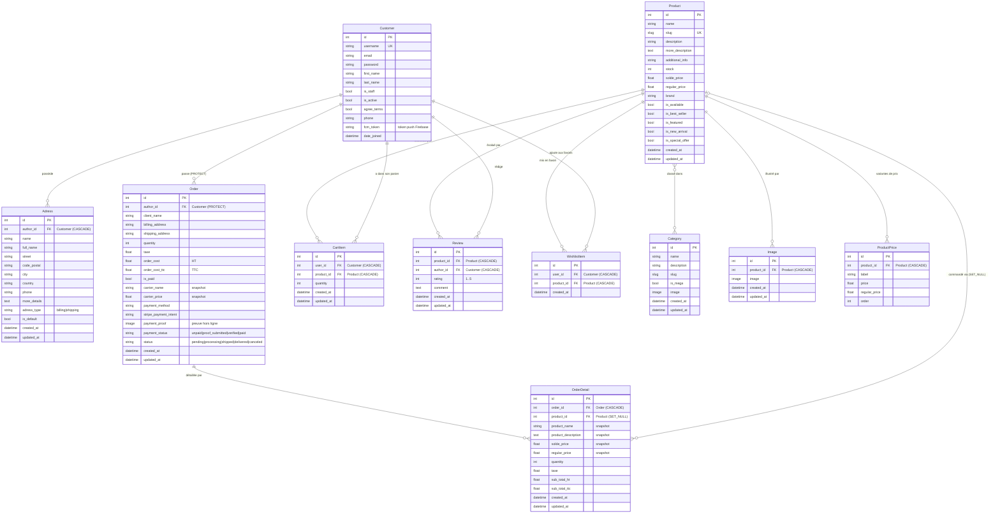

# Schéma Entité-Relation — Hayiti's

Diagramme ER de l'ensemble des modèles de données du projet, généré à partir des
modèles Django (`accounts`, `dashboard`, `shop`, `api`).

> Rendu automatique sur GitHub, dans la plupart des IDE et sur https://mermaid.live

## Diagramme complet

> **Contraintes d'unicité (`unique_together`)** non représentables en arêtes Mermaid :
> `CartItem(user, product)`, `Review(product, author)`, `WishlistItem(user, product)`,
> `ExchangeRate(base_currency, target_currency)`.

## Tables autonomes (sans clé étrangère)

Modèles de configuration et de contenu éditorial, non reliés au reste du graphe.

```mermaid
erDiagram
    Setting {
        int      id PK
        string   name
        text     description
        string   base_currency "devise de saisie"
        string   currency "devise d'affichage"
        float    taxe_rate
        image    logo
        string   street
        string   city
        string   state
        string   code_postal
        string   phone
        email    email
        text     copyright
        bool     show_app_banner
        file     apk_file ".apk Android"
        string   apk_version
        string   apk_description
        datetime created_at
        datetime updated_at
    }

    ExchangeRate {
        int      id PK
        string   base_currency
        string   target_currency
        float    rate
        datetime updated_at
    }

    Carrier {
        int      id PK
        string   name
        string   description
        text     details
        float    price
        image    image
        datetime created_at
        datetime updated_at
    }

    Method {
        int      id PK
        string   name
        string   description
        text     more_description
        image    logo
        string   test_public_key
        string   test_private_key
        string   prod_public_key
        string   prod_private_key
        bool     is_available
        datetime created_at
        datetime updated_at
    }

    Slider {
        int      id PK
        string   title
        string   description
        string   button_text
        string   button_link
        image    image
        datetime created_at
        datetime updated_at
    }

    Collection {
        int      id PK
        string   title
        string   description
        string   button_text
        string   button_link
        image    image
        datetime created_at
        datetime updated_at
    }

    Page {
        int      id PK
        string   name
        slug     slug UK
        string   subtitle
        text     content
        image    image
        string   page_type "about|terms|privacy|general"
        bool     is_head
        bool     is_foot
        bool     is_checkout
        datetime created_at
        datetime updated_at
    }

    FAQ {
        int      id PK
        string   question
        text     answer
        int      order
        bool     is_active
        datetime created_at
        datetime updated_at
    }

    ContactMessage {
        int      id PK
        string   name
        email    email
        string   subject
        text     message
        bool     is_read
        datetime created_at
    }
```

## Légende des cardinalités

| Notation Mermaid | Signification                          | Exemple                          |
|------------------|----------------------------------------|----------------------------------|
| `\|\|--o{`       | un-à-plusieurs (0..N)                   | un `Customer` → N `Order`        |
| `\|o--o{`        | un(0..1)-à-plusieurs                    | un `Product` → N `OrderDetail`   |
| `}o--o{`         | plusieurs-à-plusieurs                   | `Product` ↔ `Category`           |

**Conventions de suppression :**
- `CASCADE` — la suppression du parent supprime les enfants (ex. `Image`, `ProductPrice`, `OrderDetail`→`Order`).
- `PROTECT` — empêche la suppression d'un `Customer` ayant des `Order`.
- `SET_NULL` — la suppression d'un `Product` conserve l'`OrderDetail` (historique de commande préservé grâce aux champs dénormalisés `product_name`, `solde_price`…).

---

*Généré à partir des modèles Django du projet Hayiti's. Pour régénérer une image depuis
l'ORM : `python manage.py graph_models accounts shop dashboard api -o er.png`
(nécessite `django-extensions` + Graphviz).*
